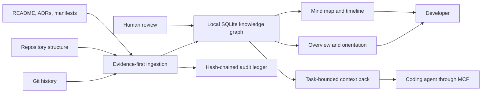

# Context Atlas

Context Atlas is a local-first, evidence-backed memory layer for software projects. It turns Git history, repository structure, manifests, project documents, and human-reviewed explanations into:

- a newcomer-friendly project overview;
- an explorable component and dependency map;
- a chronological record of how the project changed;
- evidence-linked explanations of components and decisions; and
- bounded context packs that coding agents can read before making a change.

This repository contains a working `0.1.0` alpha: a Node.js CLI, local web dashboard, TypeScript library, stdio MCP server, and packaged Codex plugin. The broader production plan remains explicitly tracked in `docs/`.

## Why it exists

Long coding sessions lose the thread. Chat histories compress, agents change, undocumented decisions disappear, and generated summaries can quietly become stale or wrong. Context Atlas keeps a durable high-level map outside any one chat while preserving a strict boundary between observed facts, documented claims, inferences, proposals, and human-approved explanations.



## Quick start

Requirements: Git and Node.js 24 or newer.

```powershell
npm.cmd ci
npm.cmd run build
node dist/cli.js init C:\path\to\your\git-repository --name "My Project"
node dist/cli.js serve --repo C:\path\to\your\git-repository
```

Open `http://127.0.0.1:4242`. The server deliberately refuses unauthenticated non-loopback hosts.

For a first handoff, use this sequence:

```powershell
node dist/cli.js overview --repo C:\path\to\repo
node dist/cli.js health --repo C:\path\to\repo
node dist/cli.js timeline --repo C:\path\to\repo
node dist/cli.js pack "add subscription retry handling" --json --repo C:\path\to\repo
node dist/cli.js proposals pending --repo C:\path\to\repo
```

Generated narrative proposals are not accepted as truth automatically. Review their evidence, then explicitly approve or reject a specific proposal:

```powershell
node dist/cli.js approve <proposal-id> --actor human:alice --note "Reviewed against ADR-0001 and current code" --repo C:\path\to\repo
node dist/cli.js reject <proposal-id> --actor human:alice --note "Superseded by the current architecture" --repo C:\path\to\repo
```

Run `sync` after meaningful commits. Health reports clearly warn when the repository has moved beyond the last indexed commit.

New repositories start with an 8,000-token context-pack budget. Existing repositories keep the value already stored in `.context-atlas/config.json`—including the legacy 4,000-token default—until an operator changes it. `pack --budget N` still overrides the repository default for one request.

Synchronization is also required after an extraction-affecting configuration or `.atlasignore` policy change. Context Atlas records a guidance-dependency watermark when content is synchronized and reviewed; changing that boundary makes prior reviewed claims unsettled. Claims created before watermark tracking fail closed and require synchronization plus a new human review rather than being silently grandfathered in.

## Codex plugin and MCP

The ready-to-install plugin bundle is in `plugin/context-atlas/`. Build this project before packaging or installing it: the build embeds a self-contained MCP runtime at `plugin/context-atlas/runtime/server.mjs`, so a copied marketplace installation does not depend on this source tree. The wrapper retains a `dist/mcp/server.js` fallback for local source development.

The MCP server exposes ten read-only tools:

- `atlas_overview`, `atlas_context_pack`, `atlas_explain`, `atlas_history`, `atlas_health`, `atlas_search`, `atlas_evidence`, `atlas_assertions`, `atlas_assertion_history`, and `atlas_assertion_evolution` are read-only.
- Synchronization, proposal creation, approval, and rejection are intentionally unavailable through MCP. Those state changes remain explicit human-operated CLI commands, so model-supplied tool arguments cannot grant mutation authority.
- `atlas_context_pack` can consume the ID of an existing human-created CLI override. It cannot create or alter an override, and overridden critical findings remain prominent in both the structured result and its text disposition.

Every tool accepts an absolute `repo` path. A direct MCP client can also run `node <absolute-project-path>/dist/mcp/server.js` and set `CONTEXT_ATLAS_REPO` to an initialized repository.

## Context-pack contract

Context-pack schema v2 always represents the same 15 required sections: identity/authority, warnings, goals, components, interfaces, conventions, decisions, constraints, risks, recent changes, tests, conflicts, unknowns, evidence, and exclusions. A section can explicitly be `present`, `none`, or `unknown`; an empty knowledge area is not silently omitted.

Selection is whole-item. Every material entity, assertion, or event admitted to the bounded selector universe is either rendered in full with its evidence closure or listed as a material exclusion with an exact reason; ambient non-material records are reported as aggregate counts. The hard budget applies to the entire compact JSON object—not only the Markdown body—and the MCP adapter also reserves space for its tool-result envelope. The current estimate is a disclosed characters-divided-by-four approximation, not a provider tokenizer. Requests as low as 500 tokens are accepted as inputs, but generation refuses with the computed minimum when the mandatory envelope cannot fit.

Before current guidance is presented or packed, local file, reachable Git commit, repository-snapshot, and component-snapshot locators are revalidated against canonical paths, policy, and SHA-256 digests. Unknown external locator kinds are reported as not validated; they are not upgraded to verified evidence. Overview, graph, search, explain, assertion, API, MCP, pack, and dashboard paths carry current-use status/reason/authority/evidence metadata or withhold unsettled reviewed prose.

## What is recorded

Context Atlas stores its local state under `<repository>/.context-atlas/`:

- `config.json`: scan and freshness policy;
- `atlas.db`: evidence, entities, versions, relationships, events, and proposals;
- `ledger.ndjson`: an append-only hash chain covering recorded actions;
- `backups/`: verified SQLite backups and portable knowledge snapshots; and
- `exports/`: checksummed, portable JSON exports.

Full raw diffs and full file bodies are not retained. Context Atlas does retain bounded, sanitized document extracts and repository metadata needed for navigation. Secret-like values and sensitive paths such as `.env`, credentials, private keys, and certificates are withheld. Add repository-specific exclusions to `.atlasignore`; its ordered glob rules support `!` negation.

Initialization creates `.context-atlas/.gitignore` so the database, exports, backups, and full pre-upgrade migration snapshots are not accidentally committed. Before a legacy store writes a migration snapshot, Context Atlas safely appends any missing derived-data rules without replacing operator rules. Commit `.context-atlas/config.json`, `.context-atlas/ledger.ndjson`, and `.context-atlas/.gitignore` when you want shared, reviewable project memory; keep ignored database material local or transfer it only through the verified backup workflow.

## Safety model

| Product risk | Implemented control |
| --- | --- |
| Plausible but false summaries | Current guidance fails closed when required evidence is missing, unusable, or policy-denied; confidence and evidence links are preserved, and unsupported proposals cannot be approved. Locator/digest validation proves provenance integrity, not that evidence semantically entails a claim, so human review and current code remain authoritative. |
| Stale context | Live HEAD, working-tree, and guidance-watermark checks prevent a previously accepted overview from rendering as settled current fact; primary CLI/API/MCP/pack/UI reads carry status, reason, authority, evidence, and warnings while immutable history remains inspectable. |
| Information overload | Graphs are deterministically bounded and report truncation; schema-v2 packs enforce whole-item selection within a 500–20,000-token compact-JSON budget and disclose material exclusions. |
| False authority | Pending proposals stay separate; packs say `navigation-only`; critical integrity failures refuse pack generation unless a human creates an immutable, attributed, expiring override. |
| Secret leakage | Sensitive-path withholding, secret detection/redaction, no raw diffs, `.atlasignore`, and local-only web serving. |
| Corrupted history | Git-derived events carry immutable schema-v5 content/ledger bindings, backed by an immutable SQLite audit outbox, fsynced hash-chained reconciliation, ignored schema snapshots, checksummed exports, and verified backup/restore primitives. Synchronization preflights timeline bindings before mutation. Narrow tests cover event-row tamper rejection, a committed-outbox process kill, torn-tail refusal, framing damage, and two recovery processes; this is not a complete crash-safety qualification. |
| Token waste and model drift | Deterministic pack IDs/content hashes, explicit repository head, relevance ranking, evidence index, and bounded output. |

Context Atlas is a navigation aid, not proof that software is correct. Current code and tests remain authoritative for runtime behavior. If a context pack is blocked, resolve the listed critical health checks. The exceptional `pack-override` workflow requires an explicit human actor, rationale, and short expiry, and the resulting pack remains visibly marked.

## Commands

Run `node dist/cli.js help` for the complete command list. The main workflows are:

- Explore: `overview`, `map`, `timeline`, `search`, `explain`, `evidence`, `assertions`, `assertion-history`, `assertion-evolution`.
- Prepare an agent: `pack <task> [--budget N] [--json]`.
- Maintain memory: `sync`, `proposals`, `propose`, `approve`, `reject`.
- Audit: `health`, `validate`, `recover-ledger`, `privacy`, `retention-preview` (`validate` exits with code 2 on critical findings; retention is preview-only).
- Portability: `export`, `verify-export`, `import-preview`, all-or-nothing `import`, `rebuild-verify`, `backup`, `verify-backup`, `restore --confirm RESTORE`.
- Visualize: `serve` on loopback.

## Development and verification

```powershell
npm.cmd run build
npm.cmd test
```

The current source contains regression coverage for end-to-end ingestion and onboarding, whole-item pack allocation, compact-JSON and MCP response caps, guidance and repository staleness, evidence-locator failure modes, proposal conflicts, secret containment, ledger recovery boundaries, exports, backup/restore, read-only MCP permissions, CSP, loopback-only web serving, and dashboard accessibility semantics.

The frozen candidate's complete behavioral suite/coverage, clean dependency-install plus live CLI/web/MCP smoke, and rendered-browser results are **UNVERIFIED** in this workspace. The managed sandbox refused the suite's child-process spawns with `EPERM`, and the final release gates have not yet run on an immutable candidate commit. Direct TypeScript emit, regenerated runtime/legal drift, plugin validation, extracted-archive CLI/MCP/static-dashboard checks, compact archive integrity, loopback refusal, and a small no-worker UI/security/health/event harness passed; those narrow checks are not substitutes for the full suite. Previous test totals and coverage percentages do not describe this source and are intentionally not repeated. Source-level accessibility changes include a skip link, live regions, combobox/listbox semantics, roving map focus, keyboard navigation, focusable semantic tables, and reduced-motion/high-contrast/forced-colors CSS; they are not a WCAG or screen-reader result.

The build copies the project license into the plugin, generates third-party notices from the dependencies actually bundled into the self-contained runtime, and release workflows are defined to reject runtime/license/notices drift. Release identity checks also compare the tag with the package, lockfile, plugin manifest, MCP-advertised version, and dated changelog. Those gates are controls in source, not evidence of a passing release until the final workflow and package smoke complete.

The implementation currently uses Node's built-in SQLite API, which Node 24 still labels experimental. This alpha is designed for a single local repository and a single writer; hosted collaboration, IDE-native panels, incremental filesystem watching, richer language-semantic analysis, and large-repository performance work remain roadmap items.

## Detailed plan and evidence

- `docs/PRODUCT_PLAN.md` — users, jobs, scope, functional and non-functional requirements.
- `docs/ARCHITECTURE.md` — temporal data model, trust boundaries, ingestion, retrieval, and deployment design.
- `docs/RISK_REGISTER.md` — failure modes, controls, tests, and residual risk.
- `docs/IMPLEMENTATION_ROADMAP.md` — milestones from prototype through production hardening.
- `docs/REQUIREMENTS_TRACEABILITY.md` — requirement-to-control/test ledger.
- `docs/IMPLEMENTATION_STATUS.md` — honest evidence for what this alpha implements and what remains planned.

## Contributing, support, and releases

- Read [`CONTRIBUTING.md`](CONTRIBUTING.md) before proposing or implementing a
  change. It documents the trust-boundary invariants and verification standard.
- Use the structured GitHub issue forms for reproducible bugs, product requests,
  and documentation problems.
- Report vulnerabilities privately using [`SECURITY.md`](SECURITY.md); never put
  credentials, proprietary source, or a real `.context-atlas/` directory in a
  public issue.
- Project participation follows [`CODE_OF_CONDUCT.md`](CODE_OF_CONDUCT.md).
- Release changes and the maintainer procedure live in [`CHANGELOG.md`](CHANGELOG.md)
  and [`docs/RELEASING.md`](docs/RELEASING.md).

## License

MIT
