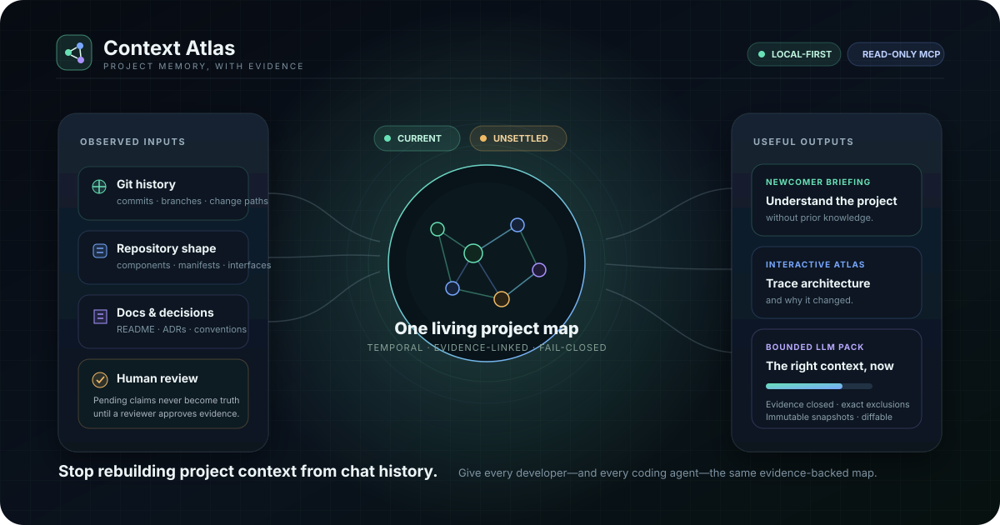
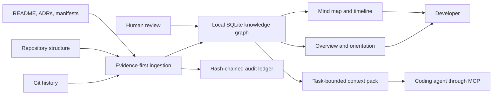

# Context Atlas

Context Atlas is a local-first, evidence-backed memory layer for software projects. It turns Git history, repository structure, manifests, project documents, and human-reviewed explanations into:

- a newcomer-friendly project overview;
- an explorable component and dependency map;
- a chronological record of how the project changed;
- evidence-linked explanations of components and decisions; and
- bounded context packs that coding agents can read before making a change;
- explicitly selected documents and conversation summaries with human consent; and
- versioned extension and provider-egress safety contracts for trusted hosts.



This repository contains the source for a working experimental `0.1.0` alpha release candidate: a Node.js CLI, local web dashboard, TypeScript library, stdio MCP server, and Codex plugin bundle. The generated plugin runtime, local behavioral gates, package candidate, clean installed-package smoke, hosted cross-platform CI, CodeQL, and dependency review have been verified. A GitHub release has not yet been published; `0.1.0` remains unpublished, and the broader production plan remains explicitly tracked in `ROADMAP.md` and `docs/`.

## Why it exists

Long coding sessions lose the thread. Chat histories compress, agents change, undocumented decisions disappear, and generated summaries can quietly become stale or wrong. Context Atlas keeps a durable high-level map outside any one chat while preserving a strict boundary between observed facts, documented claims, inferences, proposals, and human-approved explanations.



## Quick start

Requirements: Git and Node.js `>=24.12.0 <25`. See [`docs/RUNTIME_SUPPORT.md`](docs/RUNTIME_SUPPORT.md) for the tested compatibility policy.

```powershell
git clone https://github.com/moelomda/context-atlas.git
cd context-atlas
npm.cmd ci
npm.cmd run build
node dist/cli.js init C:\path\to\your\git-repository --name "My Project"
node dist/cli.js serve --repo C:\path\to\your\git-repository
```

Open `http://127.0.0.1:4242`. The server deliberately refuses unauthenticated non-loopback hosts.

For a first handoff, use this sequence:

```powershell
node dist/cli.js overview --repo C:\path\to\repo
node dist/cli.js health --repo C:\path\to\repo
node dist/cli.js timeline --repo C:\path\to\repo
node dist/cli.js pack "add subscription retry handling" --json --repo C:\path\to\repo
node dist/cli.js proposals pending --repo C:\path\to\repo
```

Generated narrative proposals are not accepted as truth automatically. Review their evidence, then explicitly approve or reject a specific proposal:

```powershell
node dist/cli.js approve <proposal-id> --actor human:alice --note "Reviewed against ADR-0001 and current code" --repo C:\path\to\repo
node dist/cli.js reject <proposal-id> --actor human:alice --note "Superseded by the current architecture" --repo C:\path\to\repo
```

The loopback dashboard also provides a human proposal-review workspace with evidence readiness, conflict grouping, review history, and explicit approve/reject confirmation. Browser mutations require an exact same-origin request and an in-memory session token; they are not agent capabilities.

One external text/Markdown document or one conversation summary can be added through the dashboard's **Add source** workflow or the CLI. Preview is read-only and binds the exact bytes, origin, purpose, authority, sensitivity, and attributed human actor. Apply requires the fresh plan plus literal `IMPORT`; sensitive imports retain metadata and provenance while omitting their body. Imported material remains untrusted evidence and never approves a claim or rewrites the overview automatically.

```powershell
$plan = node dist/cli.js source-import-preview C:\path\to\notes.md --type document --origin "Architecture workshop" --authority documented --sensitivity normal --purpose "Preserve retry decisions" --actor human:alice --repo C:\path\to\repo | ConvertFrom-Json
node dist/cli.js source-import C:\path\to\notes.md --plan $plan.planId --confirm IMPORT --type document --origin "Architecture workshop" --authority documented --sensitivity normal --purpose "Preserve retry decisions" --actor human:alice --repo C:\path\to\repo
```

Run `sync` after meaningful commits. Health reports clearly warn when the repository has moved beyond the last indexed commit.

New repositories start with an 8,000-token context-pack budget. Existing repositories keep the value already stored in `.context-atlas/config.json`—including the legacy 4,000-token default—until an operator changes it. `pack --budget N` still overrides the repository default for one request.

Synchronization is also required after an extraction-affecting configuration or `.atlasignore` policy change. Context Atlas records a guidance-dependency watermark when content is synchronized and reviewed; changing that boundary makes prior reviewed claims unsettled. Claims created before watermark tracking fail closed and require synchronization plus a new human review rather than being silently grandfathered in.

## Codex plugin and MCP

The plugin source bundle is in `plugin/context-atlas/`. Build and verify this project before packaging or installing it: the build embeds a self-contained MCP runtime at `plugin/context-atlas/runtime/server.mjs`, so a verified copied marketplace installation does not depend on this source tree. The wrapper retains a `dist/mcp/server.js` fallback for local source development.

The MCP server exposes 13 read-only tools:

- Current navigation: `atlas_overview`, `atlas_context_pack`, `atlas_explain`, `atlas_history`, `atlas_health`, `atlas_search`, and `atlas_evidence`.
- Temporal knowledge: `atlas_assertions`, `atlas_assertion_history`, and `atlas_assertion_evolution`.
- Saved-pack inspection: `atlas_pack_history`, `atlas_pack_snapshot`, and `atlas_pack_diff`.
- Synchronization, proposal creation, proposal decisions, pack save/refresh, and retention apply are intentionally unavailable through MCP. Proposal decisions require an explicit human through the CLI or protected loopback dashboard; the other mutations remain human-operated CLI workflows.
- `atlas_context_pack` can consume the ID of an existing human-created CLI override. It cannot create or alter an override, and overridden critical findings remain prominent in both the structured result and its text disposition.

Every tool accepts an absolute `repo` path. A direct MCP client can also run `node <absolute-project-path>/dist/mcp/server.js` and set `CONTEXT_ATLAS_REPO` to an initialized repository.

Versioned HTTP and MCP reads compare the knowledge database, live Git/worktree, ledger, synchronization, and guidance-policy boundaries before and after assembling a response; a concurrent change is refused with a retryable snapshot error instead of attaching a newer watermark to older data. Saved-pack history and diff tools return one compact structured payload with a short text pointer, and every MCP tool result has a 2,500,000-character fail-closed ceiling.

Trusted in-process extensions can use the public `context-atlas/extensions` export. Its six versioned ports cover extractors, analyzers, providers, redactors, exporters, and validators; manifests and inputs/outputs are schema-checked, unsafe outputs fail atomically, and installed extension code is explicitly treated as trusted executable code. The core library also exposes an exact-byte egress preview/consent/authorization gateway with provider allowlists, redaction/block policy, token/cost budgets, credential indirection, durable attempt receipts, revocation, and no automatic retries. No remote provider is enabled by the CLI, web dashboard, or MCP server in this alpha.

## Context-pack contract

Context-pack schema v2 always represents the same 15 required sections: identity/authority, warnings, goals, components, interfaces, conventions, decisions, constraints, risks, recent changes, tests, conflicts, unknowns, evidence, and exclusions. A section can explicitly be `present`, `none`, or `unknown`; an empty knowledge area is not silently omitted.

Selection is whole-item. Every material entity, active relationship, assertion, or event admitted to the bounded selector universe is either rendered in full with its evidence closure or listed as a material exclusion with an exact reason; ambient non-material records are reported as aggregate counts. Relationships carry current-use status, reason, authority, confidence, and evidence-validation metadata, and unverified topology is not presented as settled guidance. The hard budget applies to the entire compact JSON object—not only the Markdown body—and the MCP adapter also reserves space for its tool-result envelope. The current estimate is a disclosed characters-divided-by-four approximation, not a provider tokenizer. Requests as low as 500 tokens are accepted as inputs, but generation refuses with the computed minimum when the mandatory envelope cannot fit.

`pack-save` stores a verified pack as an immutable, content-addressed snapshot. `pack-history`, `pack-diff`, and `pack-refresh` provide bounded history, structural comparison, and rebuild-against-current-state workflows. Snapshots live under `.context-atlas/packs/`; the store refuses a 257th distinct snapshot instead of silently deleting history. Refresh preserves the original task and token budget, does not inherit a previous safety override, and refuses repository-identity or unstable repository/policy changes. History reads verify the retained set before applying the requested display limit, so the 256-item bound is a safety ceiling, not a large-history performance qualification.

Before current guidance is presented or packed, local file, reachable Git commit, repository-snapshot, and component-snapshot locators are revalidated against canonical paths, policy, and SHA-256 digests. Unknown external locator kinds are reported as not validated; they are not upgraded to verified evidence. Overview, graph, search, explain, assertion, API, MCP, pack, and dashboard paths carry current-use status/reason/authority/evidence metadata or withhold unsettled reviewed prose.

## What is recorded

Context Atlas stores its local state under `<repository>/.context-atlas/`:

- `config.json`: scan and freshness policy;
- `atlas.db`: evidence, entities, versions, relationships, events, and proposals;
- `ledger.ndjson`: an append-only hash chain covering recorded actions;
- `backups/`: verified SQLite backups and portable knowledge snapshots;
- `exports/`: checksummed, portable JSON exports; and
- `packs/`: ignored, immutable context-pack snapshots with a hard 256-item capacity.

Full raw diffs and full file bodies are not retained. Context Atlas does retain bounded, sanitized document extracts and repository metadata needed for navigation. Secret-like values and sensitive paths such as `.env`, credentials, private keys, and certificates are withheld. Add repository-specific exclusions to `.atlasignore`; its ordered glob rules support `!` negation.

Initialization creates `.context-atlas/.gitignore` so the database, exports, backups, packs, and full pre-upgrade migration snapshots are not accidentally committed. Before legacy storage writes a migration snapshot or a pack, Context Atlas safely appends the missing derived-data rule without replacing operator rules. Commit `.context-atlas/config.json`, `.context-atlas/ledger.ndjson`, and `.context-atlas/.gitignore` when you want shared, reviewable project memory; keep ignored database material local or transfer it only through the verified backup workflow.

## Safety model

| Product risk | Implemented control |
| --- | --- |
| Plausible but false summaries | Current guidance fails closed when required evidence is missing, unusable, or policy-denied; confidence and evidence links are preserved, and unsupported proposals cannot be approved. Locator/digest validation proves provenance integrity, not that evidence semantically entails a claim, so human review and current code remain authoritative. |
| Stale context | Live HEAD, working-tree, and guidance-watermark checks prevent a previously accepted overview from rendering as settled current fact; primary CLI/API/MCP/pack/UI reads carry status, reason, authority, evidence, and warnings while immutable history remains inspectable. |
| Information overload | Graph nodes are deterministically bounded and report truncation; schema-v2 packs enforce whole-item selection within a 500–20,000-token compact-JSON budget and disclose material exclusions. Relationship scans/edge volume do not yet have an independent scale-qualified cap. |
| False authority | Pending proposals stay separate; packs say `navigation-only`; critical integrity failures refuse pack generation unless a human creates an immutable, attributed, expiring override. |
| Secret leakage | Sensitive-path withholding, secret detection/redaction, no raw diffs, `.atlasignore`, local-only web serving, and a tested opt-in egress library that requires exact-byte preview, consent, one-attempt authorization, budget reservation, and durable audit before a host can transmit. No product provider is enabled by default. |
| Corrupted history | Git-derived events carry immutable schema-v5 content/ledger bindings, backed by an immutable SQLite audit outbox, fsynced hash-chained reconciliation, ignored schema snapshots, checksummed exports, and verified backup/restore primitives. Synchronization preflights timeline bindings before mutation. Narrow tests cover event-row tamper rejection, a committed-outbox process kill, torn-tail refusal, framing damage, and two recovery processes; this is not a complete crash-safety qualification. |
| Token waste and model drift | Deterministic pack IDs/content hashes, explicit repository head, relevance ranking, evidence index, and bounded output. |
| Overbroad retention | Retention apply accepts only a fresh preview plan plus literal confirmation, an attributed `human:` actor, and a non-secret rationale. It can unlink only individually inventoried export/backup files, refuses unsafe, linked, changed, or incomplete inventories, and records started/completed/partial ledger tombstones. It never targets the canonical database, ledger, review history, or SQLite operational files; this is not secure media erasure or a general cache/log retention system. |

Context Atlas is a navigation aid, not proof that software is correct. Current code and tests remain authoritative for runtime behavior. If a context pack is blocked, resolve the listed critical health checks. The exceptional `pack-override` workflow requires an explicit human actor, rationale, and short expiry, and the resulting pack remains visibly marked.

## Commands

Run `node dist/cli.js help` for the complete command list. The main workflows are:

- Explore: `overview`, `map`, `timeline`, `search`, `explain`, `evidence`, `assertions`, `assertion-history`, `assertion-evolution`.
- Prepare an agent: `pack <task> [--budget N] [--json]`, `pack-save <task>`, `pack-history`, `pack-diff <left> <right>`, `pack-refresh <snapshot>`.
- Maintain memory: `sync`, `proposals`, `propose`, `approve`, `reject`; approve/reject are also available to a human in the protected loopback dashboard.
- Add selected evidence: `source-import-preview <file>` followed by `source-import <file> --plan <id> --confirm IMPORT`; the dashboard provides the same preview/consent boundary for one browser-selected file or pasted summary.
- Audit: `health`, `validate`, `recover-ledger`, `privacy`, `retention-preview`, confirmed `retention-apply`, and `retention-history` (`validate` exits with code 2 on critical findings). Retention deletion is limited to eligible export/backup files and requires the exact preview plan ID, `human:` actor, rationale, and `--confirm APPLY`.
- Portability: `export`, `verify-export`, `import-preview`, all-or-nothing `import`, `rebuild-verify`, `backup`, `verify-backup`, `restore --confirm RESTORE`.
- Visualize: `serve` on loopback.

## Development and verification

```powershell
npm.cmd run build
npm.cmd test
```

The current local worktree has passed the normal behavioral suite (**122/122 tests in 693,394 ms**) and the coverage run (**122/122 tests in 901,735 ms; 95.40% lines, 96.07% functions, and 76.81% branches**). Strict source/test TypeScript compilation, JavaScript syntax, JSON/YAML parsing, release-identity validation, and an online `npm audit` with zero reported vulnerabilities also passed. These are local Windows results, not cross-platform or hosted results.

The final local performance pass also removed duplicate repository/evidence work from the overview contract: on a nine-entity fixture, a real `/api/v1/overview` request fell from roughly 8–12 seconds and 58 Git subprocesses to 1.48–1.61 seconds and 12 Git subprocesses while preserving before/after snapshot checks. This is a focused small-fixture regression result, not a large-repository latency qualification.

The plugin was regenerated from this source: source and bundled runtime each expose the same 13 read-only tools, plugin and skill validators pass, independent runtime and third-party-notice regeneration produced deterministic hashes, and the real regenerated runtime passed its MCP regression (**1/1**). Workflow inspection with pinned Actionlint 1.7.12 passed all four workflows; all 17 workflow `uses` references are full-SHA pinned, covering seven unique commits that were resolved and verified. These checks do not substitute for GitHub-hosted CI, CodeQL, dependency review, SBOM, or provenance jobs.

Rendered in-app browser QA on 2026-08-23 covered the desktop viewport plus 390×844 and 320×720 layouts, including the overview and the complete external-source preview/consent flow. It verified that confirmation stays hidden until preview, completed a local import, checked responsive reflow and minimum-width overflow, and ended with zero console warnings or errors. The run found and fixed premature confirmation visibility and 320px horizontal overflow; the updated web suite passed **6/6**. Earlier navigation, map, timeline, health, review, search, briefing, keyboard, Escape, and focus-return coverage remains part of the source test contract, but this is not a screen-reader result, WCAG conformance claim, cross-browser matrix, or proof on another operating system.

After the feature and rendered-UI fixes, a 124-file local package candidate was rebuilt and passed inventory, forbidden-file, size, SHA-1, and SHA-512 verification. A clean temporary project installed that archive and its dependencies, imported a selected external source, loaded the dashboard/API and protected review API, imported the public extension subpath, and passed privacy, override, and MCP smoke; the smoke verified the complete 13-tool read-only inventory and exercised representative navigation, pack-history, evidence, and override reads. Documentation edits create a new archive candidate, so the final handoff records only the most recent post-documentation requalification. Exact archive digests and sizes stay in the local pack report rather than this self-referential document. This remains local artifact evidence, not a remote repository, hosted check, signed/SBOM-attested artifact, or published prerelease.

The build copies the project license into the plugin, generates third-party notices from the dependencies actually bundled into the self-contained runtime, and release workflows are defined to reject runtime/license/notices drift. Local runtime/notices drift and release-identity checks pass, including parity among the candidate tag input, package, lockfile, plugin manifest, MCP-advertised version, and dated changelog. The latest local package smoke also passes, but these controls do not prove hosted execution or publication; the same gates still need to pass on the immutable commit selected for a real GitHub prerelease.

The implementation currently uses Node's built-in SQLite API, which Node 24 still labels experimental. This alpha is designed for a single local repository and a single writer; hosted collaboration, IDE-native panels, incremental filesystem watching, provider-store/UI integration, richer language-semantic analysis, and large-repository performance work remain roadmap items. Saved-pack private-path detection blocks the current repository root and a broad set of recognizable host filesystem roots, but free text cannot perfectly distinguish every custom POSIX absolute path from an API route. Retention narrows path races with descriptor and identity checks but does not claim race-free deletion against a malicious same-user directory-component swap.

## Detailed plan and evidence

- `docs/PRODUCT_PLAN.md` — users, jobs, scope, functional and non-functional requirements.
- `docs/ARCHITECTURE.md` — temporal data model, trust boundaries, ingestion, retrieval, and deployment design.
- `docs/RISK_REGISTER.md` — failure modes, controls, tests, and residual risk.
- `docs/IMPLEMENTATION_ROADMAP.md` — milestones from prototype through production hardening.
- `docs/REQUIREMENTS_TRACEABILITY.md` — requirement-to-control/test ledger.
- `docs/IMPLEMENTATION_STATUS.md` — honest evidence for what this alpha implements and what remains planned.

## Contributing, support, and releases

- Read [`CONTRIBUTING.md`](CONTRIBUTING.md) before proposing or implementing a
  change. It documents the trust-boundary invariants and verification standard.
- Use the structured GitHub issue forms for reproducible bugs, product requests,
  and documentation problems.
- Report vulnerabilities privately using [`SECURITY.md`](SECURITY.md); never put
  credentials, proprietary source, or a real `.context-atlas/` directory in a
  public issue.
- Project participation follows [`CODE_OF_CONDUCT.md`](CODE_OF_CONDUCT.md).
- Release changes and the maintainer procedure live in [`CHANGELOG.md`](CHANGELOG.md)
  and [`docs/RELEASING.md`](docs/RELEASING.md).

## License

MIT
