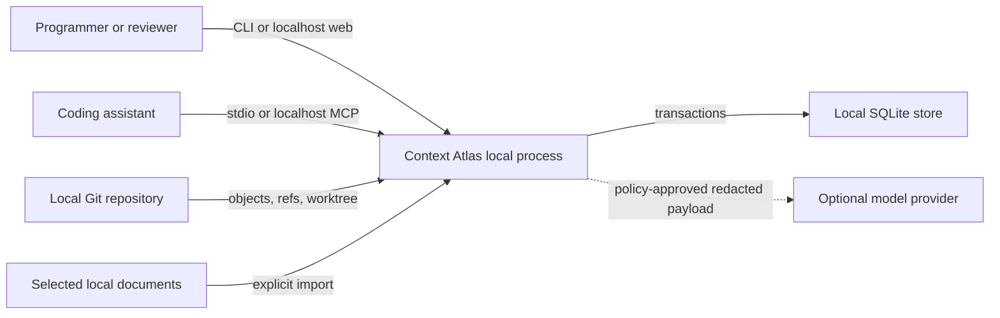
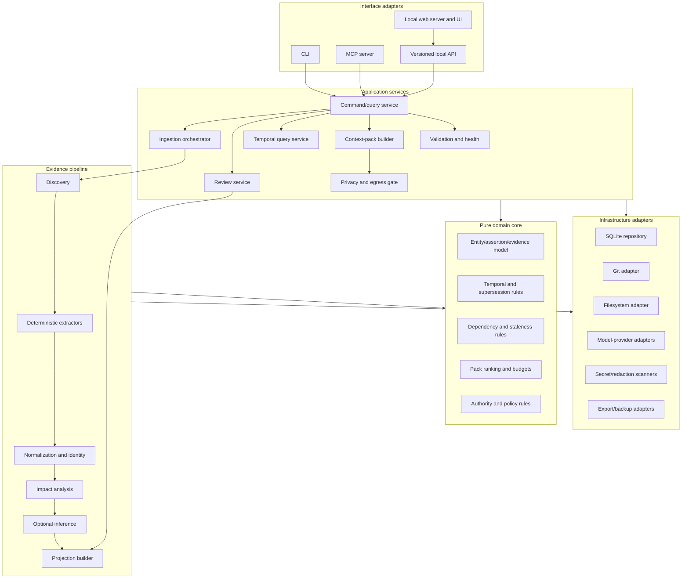
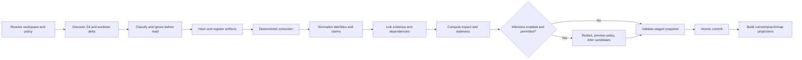

# Context Atlas Architecture

Status: **target architecture and implementation blueprint; not a current-state completion claim**
Related documents: `PRODUCT_PLAN.md`, `RISK_REGISTER.md`, `IMPLEMENTATION_ROADMAP.md`, `REQUIREMENTS_TRACEABILITY.md`

This document describes the intended end-state design. Its diagrams, route/tool tables, extension interfaces, failure behavior, test layers, and acceptance gates are **targets** unless a paragraph explicitly labeled **Current alpha subset** says otherwise. Current implementation and verification evidence lives in [`IMPLEMENTATION_STATUS.md`](./IMPLEMENTATION_STATUS.md) and [`FULL_SCOPE_AUDIT.md`](./FULL_SCOPE_AUDIT.md); as of 2026-08-20 those documents still classify 47 of 50 functional requirements as partial, three as missing, 15 of 18 non-functional requirements as partial, and three scale/performance NFRs as missing.

## 1. Architectural objectives

The architecture must make five properties structural rather than aspirational:

1. **Provenance:** every claim can be traced to immutable evidence and the process or person that produced it.
2. **Temporal integrity:** current state is derived without destroying prior states or pretending recorded time equals valid time.
3. **Safety:** local-first data boundaries, explicit egress, secret scanning, and non-self-approving model output.
4. **Rebuildability:** derived data can be recreated from Git, configuration, exported human knowledge, and versioned rules.
5. **Selective context:** human and machine consumers receive a bounded, relevant projection with visible omissions and uncertainty.

The implementation baseline is Node.js 24 and strict TypeScript. Node's built-in `node:sqlite` is the only required database. Git commands and objects are the primary repository evidence. The application runs entirely on the user's machine by default.

## 2. Constraints and assumptions

- MVP manages one Git worktree per Atlas workspace.
- The canonical repository root is resolved once and stored; commands validate it before mutation.
- The Git object database is treated as external evidence. Atlas never modifies Git objects or repository history.
- Worktree changes are evidence snapshots, not Git objects; their identity includes path, bytes hash, mode, and observation time.
- Model providers are optional adapters. The deterministic product remains functional without one.
- SQLite has one logical writer. Reads may use separate read-only connections after committed snapshots.
- Source bodies are cached only when policy permits. Git locators and hashes are preferred over unnecessary duplication.
- Generated prose is not the canonical domain model. Structured claims and evidence are canonical; prose is a versioned projection.
- All persisted and API enums are explicit, validated, and forward-compatible through an `unknown` handling rule.
- Times are stored as UTC RFC 3339 strings with millisecond precision or integer epoch milliseconds consistently per schema; UI localization happens at the edge.
- IDs are opaque stable identifiers, preferably UUIDv7 for authored records and namespaced content-derived IDs for safely deduplicated immutable evidence.

## 3. System context



Trust boundaries:

- The repository may contain malicious or untrusted text. It is data, not instruction.
- The local Atlas process and store are inside the user's device boundary but still require filesystem and browser protections.
- Browser content crosses an HTTP boundary even on loopback and requires origin/session controls.
- MCP clients may be model-driven and are not trusted to approve their own assertions or expand permissions.
- Any model-provider call crosses an explicit external boundary.

## 4. Logical architecture



Dependency direction is inward: interfaces and infrastructure depend on application ports and domain types. Domain code imports neither SQLite, HTTP, Git-process, MCP, nor model SDK modules.

## 5. Recommended repository layout

```text
context-atlas/
  apps/
    cli/                 # argument parsing and terminal presentation
    server/              # loopback HTTP API and static web host
    web/                 # browser UI
    mcp/                 # stdio/HTTP MCP adapter
  packages/
    domain/              # invariants, types, temporal rules, ranking
    application/         # use cases, ports, command/query DTOs
    storage-sqlite/      # schema, migrations, repositories, FTS
    git-adapter/         # Git object/ref/diff/worktree evidence
    extractors-core/     # manifests, Markdown, file/module/test structure
    analyzers-ts/        # TS/JS symbol and import analysis
    inference/           # candidate generation and provider-neutral prompts
    privacy/             # ignore rules, classification, secret scan, redaction
    context-pack/        # selection, budgeting, Markdown/JSON serializers
    export/              # portable export, import, backup, recovery
    contracts/           # versioned API/CLI JSON/MCP/export schemas
    test-fixtures/       # generated repositories and seeded threat cases
  docs/
  migrations/
  scripts/
```

If initial implementation uses one package for speed, it should preserve these module boundaries and dependency rules so physical extraction is mechanical later.

## 6. Canonical domain model

### 6.1 Design rules

- Evidence is immutable.
- Assertions are immutable revisions; changes create successors.
- An entity supplies stable identity, not mutable descriptive truth.
- Relationships that convey meaning are themselves asserted and evidenced.
- A review never mutates the candidate it evaluates.
- Current state is selected through validity, transaction time, lifecycle state, and supersession rules.
- Derived projections can be discarded and rebuilt.
- Soft deletion is represented by lifecycle events. Physical deletion is reserved for explicit privacy retention and leaves a non-sensitive tombstone where audit policy requires it.

### 6.2 Core records

#### Workspace and source

- `workspace`: Atlas identity, canonical root, created time, schema version, policy version.
- `repository`: Git identity, object format, common directory, worktree root, default branch discovery state.
- `source_snapshot`: an ingestion boundary describing HEAD/ref state, dirty state, worktree fingerprint, configuration hash, and extractor set hash.
- `ingestion_run`: run state, cursor, phase, counts, error summary, start/end times, previous and candidate snapshot.
- `artifact`: immutable source identity such as commit, tree, blob, diff hunk, worktree file, document revision, or imported note.
- `evidence_fragment`: addressable range or structural fragment within an artifact.

#### Knowledge

- `entity`: stable typed identity with kind and canonical key.
- `entity_alias`: versioned searchable name/path/symbol alias.
- `assertion`: immutable statement revision about a subject, predicate, typed value/object, scope, authority class, confidence, valid interval, recorded time, lifecycle state, and producer.
- `assertion_evidence`: support, contradiction, context, or derivation edge from an assertion to evidence or another assertion.
- `relation`: convenience projection of assertions whose object is another entity; not a separate source of truth.
- `decision`: entity subtype whose assertions capture context, options, chosen outcome, rationale, consequences, and lifecycle.
- `event`: immutable occurrence linking source snapshot, actors, affected entities, change class, and evidence.
- `conflict`: detected incompatibility set, rule identity, status, severity, and resolution reference.
- `dependency_edge`: derived impact edge between evidence, assertions, entities, and projections.

#### Governance and output

- `candidate_batch`: inference/extractor proposal set with exact input hashes, producer version, policy, and optional model metadata.
- `review_action`: immutable approve/edit/reject/defer/withdraw action against a revision or batch.
- `audit_event`: append-only security/domain mutation record.
- `projection`: disposable generated overview/map/timeline/search document keyed by inputs and projection version.
- `context_pack`: immutable pack manifest with task hash, selection manifest, budgets, warnings, policy, source snapshot, and output hashes.
- `egress_attempt`: non-secret audit metadata for previewed, blocked, cancelled, failed, or completed remote calls.
- `validation_run`: rule versions, findings, severity, and evidence.
- `backup_manifest`: included logical/physical items, checksums, schema/export versions, and restoration metadata.

### 6.3 Assertion shape

Conceptual TypeScript, not a persistence API:

```ts
type Assertion = {
  id: string;
  logicalId: string;
  revision: number;
  subjectEntityId: string;
  predicate: string;
  value: TypedValue;
  scope: Scope;
  authority: "observed" | "derived" | "human" | "inferred";
  lifecycle:
    | "candidate"
    | "reviewed"
    | "rejected"
    | "superseded"
    | "stale"
    | "conflicting"
    | "withdrawn";
  confidence: number | null;
  confidenceMethod: string | null;
  validFrom: string;
  validTo: string | null;
  recordedAt: string;
  supersedesAssertionId: string | null;
  producer: ProducerIdentity;
  contentHash: string;
};
```

The database additionally stores structured payload JSON only after schema validation. Core predicates should use typed relational columns where querying/invariants require them; arbitrary plugin payloads remain namespaced and schema-versioned.

### 6.4 Bitemporal semantics

Context Atlas tracks:

- **Valid time:** when the statement applies to the project. Example: a decision is effective from commit A until commit D.
- **Recorded time:** when Atlas learned the statement. Example: rationale for commit A is added by a maintainer two weeks later.

`as of valid time V, known at recorded time R` queries select assertions whose valid interval contains V and whose recorded revision existed at R, then apply lifecycle and supersession rules as they were known at R. This supports honest historical reconstruction and avoids backdated annotations silently changing what Atlas claimed to know in the past.

Rules:

- `valid_to` is exclusive.
- An assertion cannot supersede itself or create a cycle.
- Overlapping reviewed scalar assertions for the same subject/predicate/scope cause a conflict unless the predicate explicitly permits multiplicity.
- Machine inference cannot directly supersede a reviewed human assertion.
- Backdated human revisions are allowed but must record the later `recorded_at` and produce an audit event.
- Source-observed assertions align validity to the evidence snapshot or Git range, not the wall-clock ingestion time.

### 6.5 Evidence locators

Locators are typed and resolvable without trusting display text:

- Git object: repository ID plus object ID.
- File at commit: object ID, normalized repository-relative path, optional byte/line/symbol range.
- Diff: parent and child object IDs plus normalized hunk identity.
- Worktree file: snapshot ID, path, content hash, optional range.
- Imported document: import ID, original URI/path classification, content hash, fragment range.
- Human statement: review/annotation ID and actor identity.

Line numbers are hints because they drift. The stable anchor is object/content hash plus a structural symbol or fragment fingerprint. Resolver output says `exact`, `relocated`, `ambiguous`, `missing`, or `policy-hidden`.

### 6.6 Source authority and rationale

An observed code structure may establish that component A imports B. It does not establish why. A commit message may be quoted as human-authored evidence but is not automatically a reviewed architectural decision. An inference such as `PostgreSQL was chosen for transactions` remains a candidate even if source code strongly supports use of PostgreSQL. Rationale becomes current reviewed knowledge only through explicit human evidence or approval.

## 7. SQLite persistence architecture

### 7.1 Storage split

One workspace store contains:

- **Canonical tables:** evidence identities, entity identity, assertion revisions, review actions, audit events, configuration history, export metadata.
- **Derived tables:** current assertion projection, dependency closure, FTS indexes, map layout cache, summaries, pack candidate scores.
- **Operational tables:** ingestion runs, checkpoints, leases, provider-cache metadata, validation findings.

Derived and operational data can be discarded without losing approved project memory. Canonical data must be included in backups and portable exports according to policy.

### 7.2 Representative schema

The final SQL lives in numbered migrations. This outline names required constraints:

```sql
CREATE TABLE entity (
  id TEXT PRIMARY KEY,
  kind TEXT NOT NULL,
  canonical_key TEXT NOT NULL,
  created_at TEXT NOT NULL,
  content_hash TEXT NOT NULL,
  UNIQUE(kind, canonical_key)
) STRICT;

CREATE TABLE artifact (
  id TEXT PRIMARY KEY,
  kind TEXT NOT NULL,
  repository_id TEXT,
  locator_json TEXT NOT NULL CHECK(json_valid(locator_json)),
  content_hash TEXT NOT NULL,
  observed_at TEXT NOT NULL,
  extractor_version TEXT NOT NULL,
  sensitivity TEXT NOT NULL,
  UNIQUE(kind, content_hash, locator_json)
) STRICT;

CREATE TABLE assertion (
  id TEXT PRIMARY KEY,
  logical_id TEXT NOT NULL,
  revision INTEGER NOT NULL CHECK(revision > 0),
  subject_entity_id TEXT NOT NULL REFERENCES entity(id),
  predicate TEXT NOT NULL,
  value_json TEXT NOT NULL CHECK(json_valid(value_json)),
  scope_json TEXT NOT NULL CHECK(json_valid(scope_json)),
  authority TEXT NOT NULL,
  lifecycle TEXT NOT NULL,
  confidence REAL CHECK(confidence IS NULL OR confidence BETWEEN 0 AND 1),
  confidence_method TEXT,
  valid_from TEXT NOT NULL,
  valid_to TEXT CHECK(valid_to IS NULL OR valid_to > valid_from),
  recorded_at TEXT NOT NULL,
  supersedes_id TEXT REFERENCES assertion(id),
  producer_json TEXT NOT NULL CHECK(json_valid(producer_json)),
  content_hash TEXT NOT NULL,
  UNIQUE(logical_id, revision)
) STRICT;

CREATE TABLE assertion_evidence (
  assertion_id TEXT NOT NULL REFERENCES assertion(id),
  evidence_kind TEXT NOT NULL,
  evidence_id TEXT NOT NULL,
  role TEXT NOT NULL,
  relevance REAL CHECK(relevance BETWEEN 0 AND 1),
  PRIMARY KEY(assertion_id, evidence_kind, evidence_id, role)
) STRICT, WITHOUT ROWID;

CREATE TABLE audit_event (
  sequence INTEGER PRIMARY KEY AUTOINCREMENT,
  id TEXT NOT NULL UNIQUE,
  event_type TEXT NOT NULL,
  actor_json TEXT NOT NULL CHECK(json_valid(actor_json)),
  recorded_at TEXT NOT NULL,
  subject_json TEXT NOT NULL CHECK(json_valid(subject_json)),
  previous_hash TEXT,
  event_hash TEXT NOT NULL
) STRICT;
```

SQLite foreign keys are enabled for every connection. WAL mode may be used after filesystem capability checks. Durability level is explicit and never weakened silently. A database worker serializes write transactions; the application receives committed snapshot IDs rather than observing intermediate tables.

### 7.3 Transaction protocol

An ingestion update uses staging tables or a run namespace:

1. Create `ingestion_run` and acquire the workspace writer lease.
2. Discover evidence and write immutable artifacts in bounded transactions.
3. Write candidate observations/assertions associated with the run, not current projection.
4. Validate referential, temporal, authority, privacy, and content-hash invariants.
5. Atomically mark the source snapshot committed and switch the current projection pointer.
6. Enqueue disposable projections and FTS refresh.
7. Mark the run complete and release the lease.

Cancellation or crash before step 5 leaves the prior committed snapshot current. Restart resumes from durable checkpoints or deletes only the uncommitted run namespace after validation.

### 7.4 Migrations

- Schema version is stored both in SQLite user version and a migration ledger with checksums.
- A migration checks compatibility, free disk space, and backup status before changing canonical tables.
- Canonical transformations are copy/verify/swap where feasible.
- Downgrade is performed through a compatible export/import or a tested reverse migration; unsupported downgrade refuses safely.
- Every release fixture from the support window is upgraded in CI and semantically compared.

## 8. Ingestion pipeline



### 8.1 Discovery

- Resolve Git top-level and common directory without following an unapproved root transition.
- Capture object format, HEAD/ref, merge/rebase state, sparse-checkout/submodule/LFS indicators, and dirty summary.
- Enumerate tracked files through Git path-safe formats, never line-oriented parsing vulnerable to unusual filenames.
- Apply policy before opening contents: normalized path, ignore rules, file type, size, generated/binary classification, symlink target, submodule boundary.
- Walk reachable commits within configured branch/depth/time limits and preserve the selected reachability policy in the snapshot.
- Incremental mode compares the last committed snapshot and current evidence; a config/extractor version change may widen the impact set.

### 8.2 Deterministic extraction

Baseline extractors:

- Repository: refs, commits, parent graph, author/committer metadata, signed state when available, changed paths, rename/copy evidence.
- Files: language/type, size/hash/mode, ownership hints only if explicitly imported, generated classification.
- Manifests: package identity, scripts, dependencies, engines, workspaces, declared entry points.
- TypeScript/JavaScript: modules, imports/exports, selected symbols, routes/config patterns through versioned adapters.
- Markdown: headings, links, explicitly formatted decisions/constraints/tasks; prose remains quoted evidence, not automatically accepted truth.
- Tests: test files, suite names where supported, subject/path relationships, commands from manifests and config.
- Configuration: supported runtime/build/test/lint/deploy shapes with conservative schema-bound extraction.

Extractor output uses a common envelope with artifact ID, fragment locator, extractor name/version, deterministic claim key, value, confidence method, and dependencies. Unsupported syntax yields a diagnostic and coverage gap, not guessed structure.

### 8.3 Identity normalization

- Repository-relative paths use forward slashes internally and retain raw platform representation only for display/audit.
- File identity across commits follows Git object/path and rename evidence; uncertain renames create candidate continuity rather than silent identity merge.
- Component inference begins from deterministic boundaries such as packages, manifests, entry points, and configured roots.
- Entity merges/splits are reviewed operations because they can rewrite a large apparent history. The operation produces alias and lineage assertions rather than changing old foreign keys.
- Duplicate claims with the same canonical payload and support set are content-deduplicated while their observation occurrences remain recorded.

### 8.4 Impact and staleness

Each assertion records dependencies on artifacts, extractor/rule versions, upstream assertions, policy, and optionally provider input. On update:

1. Compute changed dependency keys.
2. Traverse reverse dependency edges with rule-specific depth and stop conditions.
3. Re-extract deterministic observations.
4. Compare semantic values, not generated prose.
5. Mark downstream reviewed/inferred claims `stale-pending` during staging.
6. Automatically revalidate only claims whose rule is deterministic and whose support remains equivalent.
7. Mark human rationale stale if the described implementation assumption changed; never automatically rewrite it.
8. Emit severity based on claim criticality, reach, pack usage, and user policy.

A freshness record explains `validated against snapshot X by rule Y`, `stale because artifacts A/B changed`, or `unknown because extractor failed`.

### 8.5 Optional inference

Inference creates candidates only. The provider-neutral service:

- Selects minimal fragments from the deterministic graph.
- Treats repository text as quoted untrusted data and uses fixed system instructions.
- Passes the payload through ignore, sensitivity, secret, redaction, token, cost, and provider policies.
- Uses structured output schemas with `claim`, `supportingEvidenceIds`, `contradictingEvidenceIds`, `uncertainties`, and `confidenceBasis`.
- Rejects output referencing evidence not in the supplied set.
- Records input-set hashes, prompt-template version, model/provider identity, policy version, timestamps, token/cost usage, and output hash.
- Never turns absence of output into a negative fact.
- Never makes review decisions in the same execution path.

Model output text is not executed, used as SQL, interpreted as a path, or fed to a shell.

### 8.6 Projection building

Projectors create:

- Current active assertion set.
- Component/feature/goal/decision/risk map.
- Event timeline.
- Search documents and FTS indexes.
- Newcomer overview outline and prose blocks.
- Health/coverage aggregates.
- Candidate pack ranking features.

Every projection manifest lists source snapshot, accepted knowledge watermark, projector version, policy version, content hash, creation time, and known warnings. A stale manifest is never served as current without a visible stale response flag.

## 9. Context-pack architecture

### 9.1 Inputs

- Task text and optional starting entity/file/symbol IDs.
- Target token budget and reserved response budget.
- Current repository snapshot or explicit historical point.
- User-selected policy and allowed sensitivity classes.
- Pack format/version and optional target-model tokenizer estimate.

Task text is data, not permission. A request mentioning a secret path does not override privacy policy.

### 9.2 Selection algorithm

1. Normalize task concepts through local lexical/path/symbol search.
2. Seed entity candidates from exact matches, aliases, active tasks, and user pins.
3. Expand through typed graph edges with weights and bounded depth.
4. Add mandatory global items: project goal, applicable constraints/conventions, critical risks, unresolved conflicts, and relevant recent change frontier.
5. Score candidates deterministically using match strength, graph distance, recency when applicable, authority, review/freshness, criticality, test relevance, and redundancy penalty.
6. Exclude policy-denied and unresolved-sensitive bodies while retaining safe tombstone warnings.
7. Reserve section budgets before filling optional detail.
8. Choose evidence snippets only after selecting the claim; prefer stable locators and compact excerpts.
9. Deduplicate semantically identical assertions and shared evidence.
10. Validate support, conflicts, freshness, and budget.
11. Serialize canonical JSON, then render Markdown from it.

Recommended default budget allocation:

| Section | Minimum reserve | Typical maximum |
|---|---:|---:|
| Task and project identity | 5% | 10% |
| Goals and acceptance context | 8% | 15% |
| Relevant architecture/components | 20% | 35% |
| Decisions/constraints/conventions | 12% | 25% |
| Risks/conflicts/unknowns/staleness | 10% | 20% |
| Tests and verification | 10% | 20% |
| Recent relevant changes | 5% | 15% |
| Evidence locator index | 8% | 15% |

When the budget is too small for mandatory safety sections, generation fails with a required minimum estimate. It does not drop warnings to fit.

### 9.3 Pack manifest

Each pack records:

- Schema version, pack ID, parent pack ID if refreshed.
- Workspace/repository ID, HEAD/worktree fingerprint, knowledge watermark.
- Task hash and optional stored task text per retention policy.
- Budget type, requested/estimated/actual counts, estimation method.
- Policy/provider/selector/projector versions.
- Selected assertion/evidence IDs and content hashes in presentation order.
- Excluded candidates grouped by reason and material exclusions listed individually.
- Stale/conflict/unknown/privacy warnings and override actor if any.
- JSON and Markdown output hashes.

### 9.4 Token estimation

The core uses a deterministic conservative character-to-token estimator. Provider adapters may supply a versioned tokenizer. The manifest labels estimates, never presents them as exact when they are not. Both hard character limits and token estimates are enforced to protect MCP clients.

**Current alpha subset (2026-08-20):** schema-v2 packs select whole entities, active relationships, assertions, and events with evidence closure and an explicit `char4-v1` estimate. CLI `pack-save`, `pack-history`, `pack-diff`, and `pack-refresh` store verified content-addressed snapshot-schema-v1 files under ignored `.context-atlas/packs/`. Refresh preserves the original task/budget, refuses repository or policy instability, and does not inherit an override. The store retains at most 256 distinct immutable snapshots and refuses overflow; it does not silently evict history or yet persist a parent-lineage edge.

## 10. Application interfaces

### 10.1 Command/query boundary

Application use cases accept validated DTOs and an actor/capability context. Representative commands:

- `InitializeWorkspace`
- `StartIngestion` / `ResumeIngestion` / `CancelIngestion`
- `CreateAnnotationCandidate`
- `ReviewAssertion`
- `ResolveConflict`
- `BuildContextPack`
- `ExportKnowledge`
- `RestoreBackup`
- `ApplyRetentionPolicy`

Representative queries:

- `GetOverview`
- `SearchKnowledge`
- `ExplainSubject`
- `GetTimeline`
- `GetMapSlice`
- `GetEvidence`
- `GetHealth`
- `PreviewEgress`
- `ComparePacks`

Commands return a mutation/audit ID and resulting watermark. Queries identify the snapshot/watermark actually read.

### 10.2 CLI surface

```text
atlas init [--dry-run] [--json]
atlas update [--full] [--no-inference] [--resume <run>] [--json]
atlas status [--json]
atlas overview [--at <commit|time>] [--format text|md|json]
atlas map [--focus <id>] [--depth <n>] [--format text|json]
atlas history [subject] [--from <ref|time>] [--to <ref|time>] [--json]
atlas explain <path|symbol|entity|claim> [--at <ref|time>] [--json]
atlas search <query> [--type ...] [--state ...] [--at ...] [--json]
atlas pack <task> --budget <tokens> [--format md|json] [--dry-run]
atlas pack refresh <pack-id> [--compare]
atlas review list [--severity ...] [--json]
atlas review approve|edit|reject|defer <candidate-id> ...
atlas validate [--level quick|full|recovery] [--json]
atlas export <target> [--knowledge-only] [--encrypt]
atlas import <source> [--dry-run]
atlas backup <target> [--encrypt]
atlas restore <source> [--dry-run]
atlas serve [--host 127.0.0.1] [--port 0]
atlas mcp [--transport stdio|http]
```

Proposed exit codes:

| Code | Meaning |
|---:|---|
| 0 | Success, no policy or integrity warnings |
| 2 | Command usage/configuration error |
| 3 | Completed with stale/conflict/coverage warnings |
| 4 | Privacy/security policy blocked action |
| 5 | Validation or integrity failure |
| 6 | Partial or resumable ingestion failure |
| 7 | Compatibility/migration failure |
| 10 | Internal error |

### 10.3 Local HTTP API

**Target HTTP contract:** routes live under `/api/v1`. Responses use a versioned envelope containing request ID, workspace ID, source snapshot, knowledge watermark, warnings, pagination, and data. Target mutations require a session nonce, same-origin check, CSRF token, actor context, and optimistic watermark where relevant.

Representative target routes (not a current endpoint inventory):

```text
GET  /api/v1/overview
GET  /api/v1/entities/:id
GET  /api/v1/assertions/:id
GET  /api/v1/evidence/:id
GET  /api/v1/search?q=...
GET  /api/v1/timeline?subject=...&from=...&to=...
GET  /api/v1/map?focus=...&depth=...
GET  /api/v1/health
POST /api/v1/ingestion-runs
POST /api/v1/reviews
POST /api/v1/conflict-resolutions
POST /api/v1/context-packs/preview
POST /api/v1/context-packs
POST /api/v1/egress-previews
```

The server does not expose arbitrary filesystem paths, Git commands, SQL, prompt execution, or generic plugin invocation.

**Current alpha subset (2026-08-20):** navigation routes are read-only, while a separate protected loopback browser surface can approve or reject proposals. It bootstraps an in-memory session token and requires an exact loopback Host/port, exact same-origin `Origin`, bounded JSON with exact actor/rationale fields, an attributed `human:` actor, and explicit UI confirmation; non-same-origin fetch metadata is rejected when supplied. The capability document therefore reports the HTTP API as not wholly read-only while keeping the agent surface read-only. Rendered in-app browser QA covered overview, map, timeline, health, review, search, and briefing at 1280×720, 390×844, and 320×720, including selected keyboard/focus flows and protected approval with a clean console. That run is not a screen-reader, WCAG, cross-browser, other-OS, or large-graph result. Authenticated identity/roles, optimistic review watermark, rate limiting, and the broader mutation routes above remain target architecture.

### 10.4 MCP surface

Target versioned tools/resources (not the current inventory):

| Name | Mode | Purpose |
|---|---|---|
| `atlas_get_overview` | read | Bounded project orientation with evidence and health |
| `atlas_search` | read | Search typed knowledge with cursor and budget |
| `atlas_explain` | read | Explain an entity/path/symbol/claim at a time point |
| `atlas_get_history` | read | Temporal events and assertion revisions |
| `atlas_get_evidence` | read | Resolve permitted evidence metadata/snippet |
| `atlas_get_health` | read | Freshness, conflicts, coverage, validation status |
| `atlas_build_context_pack` | read/derived | Generate a policy-checked immutable pack |
| `atlas_propose_annotation` | gated write | Create a candidate only; cannot approve |
| `atlas_request_update` | gated operation | Request ingestion under host confirmation |

Every response includes `schemaVersion`, `snapshot`, `watermark`, `truncated`, `nextCursor`, `warnings`, and authority/freshness metadata on claims. MCP transport defaults to stdio. HTTP transport defaults to loopback with a short-lived client token and explicit enablement.

The MCP server enforces its own maximum response size and does not trust a client-supplied larger limit beyond configured policy.

**Current alpha subset (2026-08-20):** the stdio source and regenerated bundled runtime register the same 13 tools, all read-only: overview, context pack, explain, history, health, search, evidence, assertions, assertion history, assertion evolution, saved-pack history, saved-pack snapshot, and saved-pack diff. Plugin/skill validation, deterministic runtime/notices regeneration, the real regenerated-runtime MCP regression, and a clean installed-package smoke that verified the full inventory and exercised representative tools passed locally. It exposes no sync, proposal, review, pack persistence/refresh, or retention mutation. The gated writes, resources/cursors, HTTP MCP transport, every-tool behavioral call, second-client/formal conformance, hosted artifact execution, and cross-platform execution in the target design are not implemented or not yet proven.

### 10.5 Extension interfaces

**Target extension design:** extensions would run through narrow adapters:

- `EvidenceExtractor`: receives policy-approved bytes plus artifact metadata; emits schema-validated observations and dependencies.
- `LanguageAnalyzer`: adds symbol/module/test structures for declared languages.
- `InferenceProvider`: receives an already-approved payload and returns schema-validated candidates.
- `SensitivityClassifier` / `Redactor`: returns labels/spans without logging contents.
- `Exporter`: consumes canonical export DTOs, not direct tables.
- `ValidationRule`: produces findings and evidence; cannot mutate.

These extension ports are not implemented in the current alpha (FR-042 remains missing). If installed-code extensions are added, they are trusted at the code-execution level and the UI must say this clearly. A later plugin sandbox is separate scope; schema validation alone is not a sandbox.

## 11. Security and privacy architecture

### 11.1 Assets

- Source code, Git metadata, proprietary architecture, documents, and task descriptions.
- Secrets and personal data accidentally stored in the repository or conversations.
- Human-approved decisions and audit history.
- Provider credentials and authentication/session tokens.
- Integrity of maps, histories, packs, exports, and validation results.
- Availability of the local store and ability to recover.

### 11.2 Main threats

- Prompt injection embedded in repository text attempts to redirect inference or an MCP client.
- Secret or denied-path content reaches a remote provider.
- A malicious webpage submits loopback state-changing requests.
- An overly capable MCP client approves its own claims or reads unrestricted file content.
- A crafted path, symlink, Git filename, archive, or plugin payload escapes the repository boundary.
- Model output produces fake evidence identifiers or malicious markup.
- Local store tampering or Git history rewrite makes old provenance appear valid.
- Logs, backups, exports, crash reports, or caches retain sensitive bodies.
- Dependency or release compromise executes malicious code.

Detailed likelihood/impact and control ownership are in `RISK_REGISTER.md`.

### 11.3 Controls

- Resolve canonical roots; reject boundary-crossing symlinks unless specifically configured.
- Use argument-array process APIs for Git; never interpolate repository data into a shell command.
- Parse NUL-delimited Git output for paths.
- Apply ignore/sensitivity policy before read where possible and before any inference queue without exception.
- Scan selected outbound content for secrets both before and after redaction; fail closed on scanner error for remote calls.
- Maintain provider/repository/purpose-scoped consent and immutable egress metadata.
- Keep keys in environment/OS credential mechanisms; database stores only a credential reference.
- Treat all source text as untrusted quoted material; provider output has a strict schema and evidence allowlist.
- Escape/sanitize all rendered prose; disallow raw HTML and active links by default.
- Loopback-only listener, random session secret, same-origin policy, CSRF tokens, restrictive CSP, no wildcard CORS.
- MCP capability separation; mutation confirmation occurs in a trusted host/user interface, not via model-supplied text.
- Audit hash chaining, canonical content hashes, database constraints, and validation scans.
- Backups support encryption and exclude caches/raw payloads by default.
- Signed release artifacts, lockfile integrity, dependency review, and reproducible-build evidence where practical.

### 11.4 Data classification

Default classes:

- `public`: explicitly safe for configured egress.
- `internal`: index locally; remote use only under explicit policy.
- `confidential`: local body access limited; remote blocked by default.
- `secret`: do not persist body in Atlas caches or send remotely; store finding category/location hash only.
- `denied`: path/content outside indexing scope.

Classification precedence is deny/secret/confidential/internal/public. A less restrictive model classification cannot override a deterministic path policy.

### 11.5 Retention

- Git evidence bodies may be resolved on demand rather than duplicated.
- Worktree fragment caches expire after a configurable period and content-hash mismatch.
- Raw model payload/output persistence is off by default; hashes and safe metadata remain.
- Operational logs rotate and contain identifiers/counts, not file bodies.
- Portable knowledge exports include human-approved material and locators; caches are excluded.
- Physical deletion requires a scoped plan that reports impacted assertions/projections and leaves safe audit tombstones where allowed.

**Current alpha subset (2026-08-20):** retention preview/apply/history can unlink only individually inventoried eligible files beneath `.context-atlas/exports/` and `.context-atlas/backups/`. Apply requires a fresh plan ID, attributed human actor, non-secret rationale, and literal confirmation; it refuses incomplete inventories, unsafe/symlinked directory chains, hard-linked files, and identity/content changes, and records started/completed/partial ledger tombstones. Canonical database, ledger, review history, and SQLite operational state are protected. Dependency-impact analysis, general cache/log/model retention, recursive directory cleanup, secure media erasure, and broad crash/non-resurrection qualification remain unimplemented.

## 12. Search and map architecture

SQLite FTS indexes a sanitized, derived document per entity/assertion/event/evidence metadata item. Search combines:

- Exact canonical ID/path/symbol match.
- Alias and prefix match.
- FTS lexical rank.
- Filter compatibility and temporal validity.
- Authority/freshness weighting.

Embeddings are optional post-MVP; they are derived, versioned, privacy-scoped, and never evidence. Search results explain match reason and do not allow high semantic similarity to hide stale/conflicting state.

The map endpoint returns a bounded slice, not the whole graph. The client requests focus, typed edge filters, depth, maximum nodes, time point, and state filters. Server truncation returns frontier summaries and continuation tokens. Layout coordinates are disposable UI cache and never domain knowledge.

## 13. Concurrency and lifecycle

- A workspace has one writer lease with process ID, random owner token, heartbeat, and acquisition time.
- Stale leases are recoverable only after verifying the prior process is absent and the transaction is not active.
- CLI read commands use the last committed snapshot during an update.
- Review commands use optimistic concurrency on assertion revision and knowledge watermark.
- Watch mode debounces changes and never indexes a file while its fingerprint is unstable across reads.
- Web and MCP servers subscribe to committed domain notifications; they do not read staging data.
- Graceful shutdown stops discovery, finishes or rolls back the bounded transaction, persists checkpoints, and closes listeners.

## 14. Observability and diagnostics

Structured local events include run/request correlation ID, phase, duration, counts, versions, status, and safe error code. Paths are repository-relative only when policy allows; logs hash or omit sensitive locators. No source body, prompt, provider output, credential, task text, or pack body appears by default.

Health views distinguish:

- Repository freshness.
- Extraction coverage and failures.
- Knowledge freshness and critical stale claims.
- Unresolved conflicts.
- Evidence resolver health.
- Projection freshness.
- Privacy/egress configuration.
- Backup age and last recovery validation.
- Schema/migration compatibility.

A redacted diagnostics export requires preview and produces a manifest of included fields.

## 15. Failure handling and recovery

| Failure | Required behavior |
|---|---|
| Git command fails | Preserve last snapshot; record safe diagnostic; retry only idempotent operations |
| Unsupported/corrupt source file | Isolate file failure; show coverage gap; do not infer its contents |
| Process killed during update | Prior projection remains readable; staged run resumes or is safely abandoned |
| Model timeout/malformed output | No candidate activation; cache only safe metadata; deterministic update still succeeds |
| Secret scanner unavailable | Remote call fails closed; local deterministic ingestion follows configured local policy |
| Database busy | Bounded retry with jitter; never launch a second writer; report lease owner |
| Database integrity failure | Open read-only if safe, preserve copy, restore/rebuild workflow; no automatic destructive repair |
| Git history rewritten | New lineage recorded; unreachable locators flagged; reviewed claims become review candidates, not silently rebound |
| Projection build fails | Canonical commit remains valid; serve previous projection explicitly marked stale or structured canonical fallback |
| Export partially written | Write to a new target with manifest/checksums and finalize atomically; do not overwrite known-good export |

## 16. Testing architecture

### 16.1 Test layers

- **Domain property tests:** temporal intervals, supersession cycles, authority transitions, deterministic ranking, budget invariants.
- **Schema/migration tests:** constraints, transaction crash points, upgrade/downgrade/export compatibility.
- **Extractor golden tests:** unusual filenames, encodings, renames, merges, generated/binary/large files, partial syntax, SHA-256 repos.
- **Pipeline integration tests:** full/incremental equivalence, idempotency, cancellation, rule-version invalidation, history rewrite.
- **Security tests:** traversal/symlink, Git argument injection, XSS, CSRF/DNS-rebinding defenses, prompt injection, fabricated evidence, seeded-secret egress.
- **Pack evaluation tests:** relevance rubric, mandatory-section retention, deterministic ordering, truncation manifest, token ceiling.
- **Contract tests:** CLI JSON, HTTP, export, Markdown/JSON pack, MCP, extension schemas.
- **End-to-end tests:** initialization through review, timeline, pack, backup, corruption detection, restore, and rebuild.
- **Performance/scale tests:** published synthetic/reference repositories and cold/warm benchmarks.
- **Accessibility tests:** automated checks plus keyboard/screen-reader manual scripts.

### 16.2 Golden reference repositories

Maintain generated fixtures so no proprietary repository is required:

- Small comprehensible app with explicit ADRs and known timeline.
- History with rename, copy, merge, rebase/rewrite, deletion, and conflicting docs.
- 100k-file/20k-commit performance fixture.
- Secret corpus with test-only synthetic keys and false-positive near misses.
- Malicious corpus with prompt injection, HTML/script, unusual paths, symlinks, invalid encodings, oversized files, and fabricated citations.
- Temporal corpus where rationale is recorded after its valid time and later superseded.

### 16.3 Invariants enforced in tests and validation

1. No active authoritative claim lacks permitted support.
2. Inferred output cannot become reviewed without a distinct human review action.
3. An old revision is never updated in place.
4. Current projection references one committed source snapshot and knowledge watermark.
5. A pack can reproduce its selected claim/evidence manifest or reports missing inputs.
6. Denied/secret bytes never enter provider adapter input.
7. Stale/conflicting critical content cannot silently appear as settled guidance.
8. Re-running the same ingestion does not create semantic duplicates.
9. Failed staging cannot change the current projection pointer.
10. Export/import preserves human knowledge identity, revision order, and audit linkage.

## 17. Architecture decision records to create during implementation

Before the related code merges, record explicit decisions for:

- ADR-001: monorepo/module boundaries and package manager.
- ADR-002: UUID/content-derived identity strategy.
- ADR-003: Node SQLite worker and transaction model.
- ADR-004: canonical assertion predicate/value schema.
- ADR-005: temporal query and supersession semantics.
- ADR-006: Git invocation/object-resolution strategy.
- ADR-007: ignore, sensitivity, secret, and redaction precedence.
- ADR-008: CLI/API/MCP versioning and compatibility policy.
- ADR-009: context ranking and token estimation.
- ADR-010: web authentication and loopback threat controls.
- ADR-011: export, backup encryption, and recovery design.
- ADR-012: optional model-provider abstraction and egress consent.

Each ADR must cite the requirement/risk IDs it satisfies, list alternatives, state consequences, and define a revisit trigger.

## 18. Target architecture acceptance gates

The target architecture is implemented—not merely documented—only when evidence proves all of the following. The current alpha does not meet this complete gate:

- A complete update and an equivalent sequence of incremental updates yield the same canonical observed graph.
- Crash injection at every transaction phase preserves the prior committed snapshot and supports safe resumption.
- Temporal fixtures answer current, historical, late-recorded, superseded, and conflict queries correctly.
- Every presentation surface retains authority, freshness, conflict, unknown, and evidence metadata.
- Seeded secrets, denied paths, prompt injections, malicious HTML, and fabricated evidence fail their containment tests.
- Context packs stay within hard limits, retain mandatory safety material, list exclusions, and are reproducible from manifests.
- A damaged derived index rebuilds; a restored canonical export retains reviewed knowledge and audit order.
- The supported maximum repository meets published performance thresholds.
- CLI, HTTP, MCP, pack, and export contracts pass cross-version fixtures.
